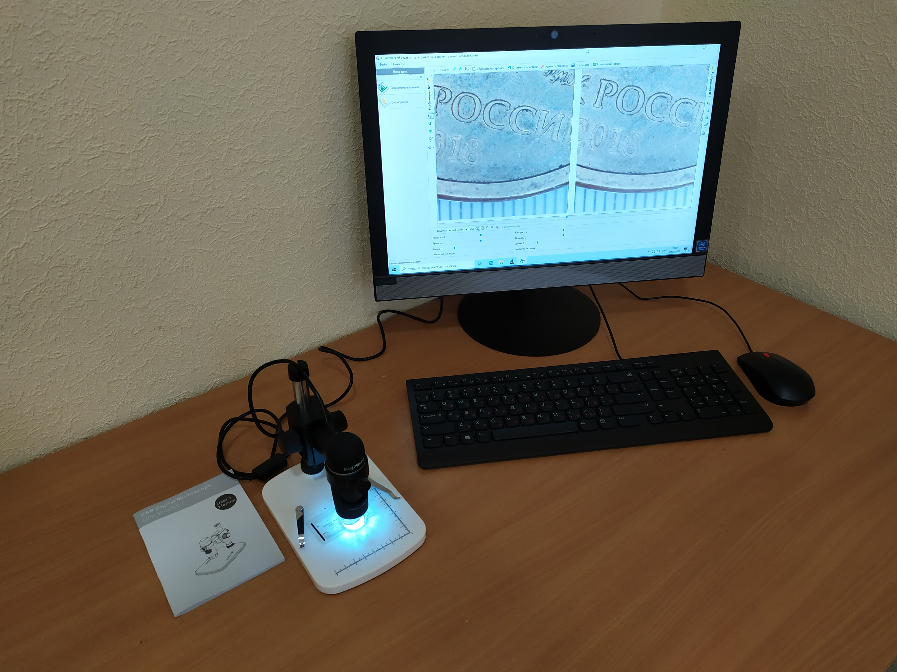

# Лаборатория криминалистического исследования документов
### Место расположения:
Главный учебный корпус, помещение 324 

 Основная цель лаборатории – оптимизация учебного процесса, повышение качества преподавания ряда дисциплин судебно-экспертной направленности, формирование практических навыков в экспертной деятельности.

Основные задачи работы лаборатории:
- расширение знаний обучающихся в области криминалистики и судебной экспертизы;
- формирование у обучающихся практических навыков и умений, связанных с проведением различных следственных действий по обнаружению, предварительному исследованию и фиксации объектов-носителей информации.

### Назначение лаборатории: проведение лабораторных и практических занятий по дисциплинам: 

**1) специальности 40.05.03 Судебная экспертиза:**
- криминалистика;
- криминалистическое исследование веществ, материалов и изделий;
- судебная фотография и видеозапись;
- трасология и трасологические экспертизы;
- пожарно-техническая экспертиза.

**2) специальности 20.05.01 Пожарная безопасность:**
- расследование пожаров;
- экспертиза пожаров.

**3) специальности 20.03.01 Техносферная безопасность (с учетом года набора обучающихся):**
- экспертиза пожаров;
- расследование пожаров.

### Оборудование лаборатории криминалистического исследования документов:

### Универсальный просмотровый детектор серии Cassida D6000

#### Основные характеристики: 
Размеры: 280х165х260 мм  
Вес: 1,45 кг  
Дисплей: LCD, 7 дюймов  
Мощность излучения лазера: 100 мВт Потребляемая мощность: 25 Вт  
Питание: 110-240 v, 50/60 Гц, через адаптер 12 v, 3 A 
Позволяет осуществить: контроль в инфракрасном свете; контроль инфракрасной люминесценции; контроль под воздействием косопадающего ик излучения; контроль в белом отраженном 
свете; контроль в белом проходящем (сквозном) свете; контроль под воздействием косопадающего белого света; контроль в ультрафиолетовом свете; контроль магнитных меток; 
контроль геометрических размеров; контроль в инфракрасном свете с увеличением; контроль инфракрасной люминесценции с увеличением; контроль под воздействием косопадающего ик 
излучения с увеличением; контроль в белом отраженном свете с увеличением; контроль в белом проходящем (сквозном) свете с увеличением; контроль под воздействием косопадающего белого света с увеличением; контроль в ультрафиолетовом свете с увеличением.

### Оснащение лаборатории позволяет отработать вопросы:
- осмотр места происшествия, в том числе пожара, с применением технических средств фиксации (криминалистическая фото-видео сьемка; выявление, фиксация и изъятие следов человека, автотранспорта и др.);
- особенности изъятия и упаковки следов-носителей криминалистически значимой информации;
- применение на практике криминалистических приборов и оборудования (ультразвукового дефектоскопа, коэрцитиметра, тепловизора и др.);
- исследование после пожара металлических (преимущественно стальных) конструкций, а также различных металлических крепежных изделий с целью установления на пожаре зон наибольших термических повреждений;
- поиск на месте пожара зон, в которых превышена концентрация газопаровоздушных смесей на основе ЛВЖ и ГЖ (используемых злоумышленниками в качестве инициаторов горения), а также определение концентрации паров светлых нефтепродуктов, спиртов, ацетона, аммиака;
- отработка версий о поджоге, поиск очага пожара, а также реконструкция возникновения и распространения горения, аварийных ситуаций;
- криминалистическая фото-видео сьемка;
- выдвижение следственных версий по составам правонарушений.
- производство нормативной пожарно-технической экспертизы (соответствие объекта исследования требованиям пожарной безопасности);
- производство следственных действий и особенности работы межведомственных СОГ.
